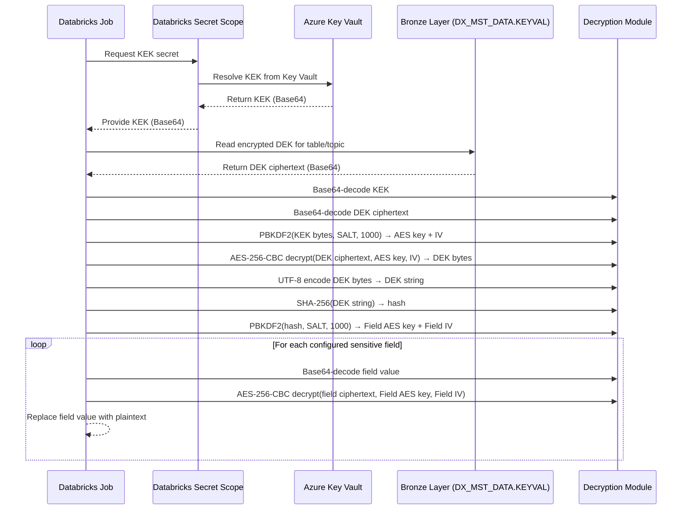
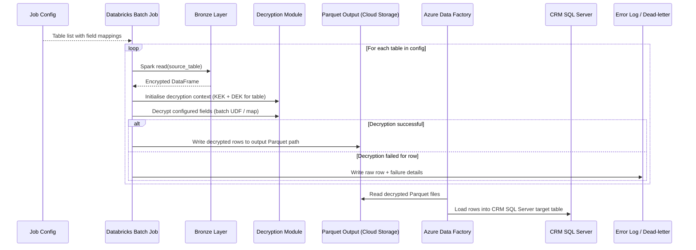
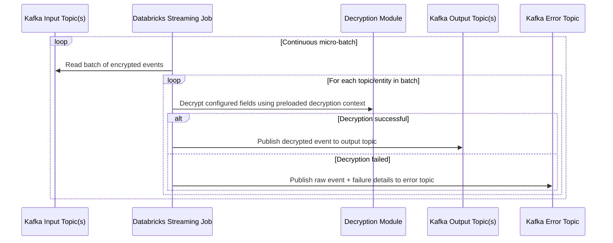

# CASMEX Data Decryption Low-Level Design

## 1. Purpose

Design a Databricks pipeline that decrypts sensitive fields in CASMEX data using a two-stage KEK/DEK model backed by Azure Key Vault and a PBKDF2/AES-CBC cryptographic scheme.

The pipeline supports two independent execution modes that share the same decryption library:

1. **Initial Load** — reads encrypted records from the bronze layer, writes decrypted output to Parquet files on cloud storage, and relies on Azure Data Factory (ADF) to load those files into CRM SQL Server.
2. **Real-Time Sync** — reads encrypted events from Kafka input topics and writes decrypted events to Kafka output topics.

Both modes handle multiple tables and topics dynamically through configuration.

---

## 2. Scope

This design covers:

- Two-stage KEK/DEK key unwrapping and derivation
- PBKDF2-based AES key and IV generation
- AES-256-CBC field-level decryption for both execution modes
- Dynamic multi-table (initial load) and multi-topic (real-time sync) processing
- Secret management via Databricks secrets backed by Azure Key Vault
- DEK retrieval from the `DX_MST_DATA.KEYVAL` bronze table
- Error handling, observability, security design, and deployment considerations

This design does not cover:

- Upstream CASMEX encryption implementation
- ADF pipeline design for loading Parquet files into CRM SQL Server
- Schema design for the CRM SQL Server target tables
- Key rotation procedures inside Azure Key Vault beyond runtime consumption of the active key
- Re-encryption or masking of already-decrypted data at rest

---

## 3. Business Context

CASMEX stores customer data with sensitive fields encrypted using a per-tenant Data Encryption Key (DEK). The DEK itself is stored in encrypted form in the `DX_MST_DATA.KEYVAL` bronze table and is protected by a Key Encryption Key (KEK) held in Azure Key Vault. The bank must unwrap the DEK at runtime, derive a field-level AES key and IV, and decrypt the sensitive fields before the data can be used by downstream CRM systems.

---

## 4. Cryptographic Specification

| Parameter | Value |
|---|---|
| Algorithm | Rijndael (AES-compatible) |
| Key Size | 256 bit |
| Block Size | 128 bit |
| Cipher Mode | CBC |
| Padding | PKCS5 / PKCS7 |
| Key Derivation | PBKDF2 |
| Hash Function | SHA-256 |
| PBKDF2 Iterations | 1000 |
| Encoding | UTF-8 |
| Cipher Format | Base64 |

---

## 5. Decryption Logic

The same multi-step process is used for every encrypted field regardless of execution mode.

### 5.1 Step-by-step key derivation and decryption

```
Step 1 — Retrieve KEK
  Read the Base64-encoded KEK string from the Databricks secret scope
  (Azure Key Vault-backed).
  Base64-decode the KEK string to obtain raw KEK bytes.

Step 2 — Retrieve DEK
  Read the Base64-encoded encrypted DEK string from DX_MST_DATA.KEYVAL
  bronze table.
  Base64-decode the encrypted DEK string to obtain encrypted DEK bytes.

Step 3 — Derive KEK-based AES key and IV
  Run PBKDF2-HMAC-SHA256 using:
    password  = KEK bytes
    salt      = configured SALT (UTF-8 bytes)
    iterations = 1000
    output    = 48 bytes
  Split the 48-byte output:
    AES key   = first 32 bytes (256 bits)
    IV        = next  16 bytes (128 bits)

Step 4 — Decrypt the DEK
  Decrypt the encrypted DEK bytes using AES-256-CBC with the AES key and IV
  derived in Step 3.
  The result is the raw DEK byte array.

Step 5 — Encode DEK as UTF-8 string
  Interpret the raw DEK byte array as a UTF-8 string.

Step 6 — Generate SHA-256 hash of the DEK string
  Compute SHA-256( UTF-8 bytes of DEK string ).
  The result is a 32-byte hash value.

Step 7 — Derive field-level AES key and IV
  Run PBKDF2-HMAC-SHA256 using:
    password  = SHA-256 hash bytes (Step 6)
    salt      = configured SALT (UTF-8 bytes)
    iterations = 1000
    output    = 48 bytes
  Split the 48-byte output:
    Field AES key = first 32 bytes (256 bits)
    Field IV      = next  16 bytes (128 bits)

Step 8 — Decrypt each configured field
  For each sensitive field in the record:
    Base64-decode the field ciphertext.
    Decrypt using AES-256-CBC with the Field AES key and Field IV from Step 7.
    Replace the encrypted field value in the output record with the plaintext.
```

### 5.2 Sequence diagram



---

## 6. Execution Mode: Initial Load

### 6.1 Purpose

Decrypt all encrypted records from the bronze layer tables and write the plaintext output to Parquet files on cloud storage. Azure Data Factory (ADF) then reads those Parquet files and loads the data into CRM SQL Server. This is a bounded, batch operation.

### 6.2 High-level flow

```
Bronze Layer (DX_MST_DATA tables)
    → Spark Batch Read
    → Per-table decryption using shared Decryption Module
    → Write decrypted output to Parquet files on cloud storage
    → ADF reads Parquet files and loads into CRM SQL Server
    → Log completion / errors
```

### 6.3 Sequence diagram



### 6.4 Runtime parameters

| Parameter | Description |
|---|---|
| `tables` | List of source/target table pairs with per-table field lists |
| `bronze_database` | Databricks / Unity Catalog database for bronze tables |
| `parquet_output_base_path` | Base path on cloud storage where decrypted Parquet files are written (one sub-directory per table) |
| `parquet_write_mode` | `overwrite` or `append` for each target Parquet path |
| `kek_secret_scope` | Databricks secret scope name |
| `kek_secret_key` | Secret key name for the KEK |
| `dek_table` | Fully qualified name of `DX_MST_DATA.KEYVAL` |
| `dek_key_column` | Column in KEYVAL used to identify the DEK for each table |
| `salt` | PBKDF2 SALT value (externalized, not hardcoded) |
| `pbkdf2_iterations` | Number of PBKDF2 iterations (default: 1000) |
| `error_output_path` | Location for failed-record dead-letter output |

### 6.5 Multi-table processing

The job reads the `tables` configuration list at startup. For each entry the job:

1. Resolves the source bronze table name and the target Parquet output path for that table.
2. Resolves the DEK for that table from `DX_MST_DATA.KEYVAL` using the configured key column.
3. Initialises a decryption context (Steps 1–7 of Section 5.1) specific to that table's DEK.
4. Applies field-level decryption (Step 8) only to the columns listed for that table.
5. Writes decrypted rows to the Parquet output path (`parquet_output_base_path/{table_name}/`).
6. Routes failed rows to the error output path with table name and failure reason.

Tables are processed sequentially by default. Parallel table processing may be enabled with job-level concurrency controls.

---

## 7. Execution Mode: Real-Time Sync

### 7.1 Purpose

Consume encrypted CASMEX events from one or more Kafka input topics in real time, decrypt the sensitive fields, and publish the decrypted events to corresponding Kafka output topics using Spark Structured Streaming.

### 7.2 High-level flow

```
Kafka Input Topics (one per CASMEX entity)
    → Spark Structured Streaming Read
    → Per-topic decryption using shared Decryption Module
    → Kafka Output Topics (one per entity)
    → Error topic for failed records
```

### 7.3 Sequence diagram



### 7.4 Runtime parameters

| Parameter | Description |
|---|---|
| `topics` | List of input/output topic pairs with per-topic field lists |
| `kafka_bootstrap_servers` | Kafka broker addresses |
| `kafka_security_config` | Authentication and TLS settings |
| `consumer_group_id` | Consumer group for checkpointing |
| `checkpoint_base_path` | Base path for Spark checkpoint directories |
| `kek_secret_scope` | Databricks secret scope name |
| `kek_secret_key` | Secret key name for the KEK |
| `dek_table` | Fully qualified name of `DX_MST_DATA.KEYVAL` |
| `dek_key_column` | Column in KEYVAL used to identify the DEK for each topic |
| `salt` | PBKDF2 SALT value |
| `pbkdf2_iterations` | Number of PBKDF2 iterations (default: 1000) |
| `error_topic` | Kafka topic for failed records |
| `trigger_interval` | Structured Streaming trigger interval |

### 7.5 Multi-topic processing

A single streaming job handles all configured topics. At startup the job:

1. Reads the `topics` configuration list.
2. For each topic entry, resolves the DEK from `DX_MST_DATA.KEYVAL` and initialises a decryption context (Steps 1–7 of Section 5.1). Decryption contexts are cached in the driver and broadcast to executors.
3. Creates a union read over all configured input topics using `subscribePattern` or a multi-topic subscription.
4. On each micro-batch, routes each record to the correct decryption context based on the `topic` column from the Kafka source.
5. Writes successfully decrypted records to the corresponding output topic.
6. Writes failed records to the error topic.

Each topic pair uses its own checkpoint sub-directory under `checkpoint_base_path/{topic_name}` to ensure independent offset tracking.

---

## 8. Shared Decryption Module Design

Both execution modes delegate to a common decryption module. This ensures the cryptographic logic is implemented once and tested independently.

### 8.1 Module responsibilities

- Accept the raw KEK bytes and encrypted DEK bytes as inputs.
- Execute Steps 3–7 from Section 5.1 to derive the field-level AES key and IV.
- Expose a `decrypt_field(ciphertext_b64: str) -> str` function that executes Step 8.
- Be stateless with respect to data records; only the derived key/IV state is held after initialisation.

### 8.2 Initialisation

The decryption context is initialised once per table or topic:

```
DecryptionContext(kek_bytes, encrypted_dek_bytes, salt, iterations)
  → derives and stores (field_aes_key, field_iv)
  → exposes decrypt_field(ciphertext_b64)
```

The context object is serializable for Spark broadcast where needed.

### 8.3 Field decryption

```
decrypt_field(ciphertext_b64):
  1. Base64-decode ciphertext_b64
  2. AES-256-CBC decrypt using stored field_aes_key and field_iv
  3. UTF-8 decode plaintext bytes
  4. Return plaintext string
```

---

## 9. DEK Retrieval

- The encrypted DEK is stored in the `DX_MST_DATA.KEYVAL` bronze table.
- The table is expected to contain at minimum a key identifier column and a Base64-encoded encrypted value column.
- The job reads the DEK for each table or topic by matching the configured `dek_key_column` value.
- DEK values are read once at job startup and cached. If a DEK rotation is required, the job must be restarted.
- The DEK read is performed using a Spark batch query against the bronze layer, isolated from the main processing path.

---

## 10. Secret and Key Handling

- The KEK is stored in Azure Key Vault and accessed through an Azure Key Vault-backed Databricks secret scope.
- The KEK is retrieved once at job startup and never re-fetched during processing unless the job restarts.
- The KEK, raw DEK bytes, and derived AES keys must never be logged, written to persistent storage, or included in output records.
- The PBKDF2 SALT is an operational parameter stored in job configuration (not hardcoded); it must not appear in plaintext in logs.
- Access to the secret scope must be restricted to the job service principal only.
- AES-CBC decryption failures are treated as security-significant events and counted separately in metrics.

---

## 11. Error Handling

### 11.1 Failure scenarios

| Scenario | Handling |
|---|---|
| KEK secret not found or inaccessible | Abort job startup; do not process any records |
| DEK not found in KEYVAL table | Abort job startup for that table/topic; skip processing for that entity |
| PBKDF2 derivation failure | Abort job startup; raise alert |
| AES-CBC decryption failure for DEK unwrap | Abort job startup; raise alert |
| Base64 decode failure for a field value | Route record to error output; continue processing |
| AES-CBC decryption failure for a field | Route record to error output; continue processing |
| Malformed record (missing field, null key) | Route record to error output; continue processing |
| Parquet write failure (initial load) | Retry with backoff; raise alert if unresolvable |
| Kafka write failure (real-time sync) | Retry with backoff; raise alert if unresolvable |

### 11.2 Error record schema

Failed records are routed to the error output (dead-letter path or error topic) with:

- `source_table` or `source_topic`
- `raw_record` — original encrypted payload
- `failure_category` — e.g. `BASE64_DECODE_ERROR`, `AES_DECRYPT_ERROR`, `MISSING_FIELD`
- `failure_reason` — exception message (sanitized; no key material)
- `processing_timestamp`
- `kafka_metadata` (real-time sync only): partition, offset

---

## 12. Schema and Data Handling Decisions

### 12.1 Dynamic field configuration

- The list of fields to decrypt is driven entirely by per-table or per-topic configuration.
- No field names are hardcoded in the decryption module.
- New non-sensitive fields flow through unchanged.

### 12.2 Null and empty values

- Null field values are passed through without attempting decryption.
- Empty string field values are passed through without attempting decryption.

### 12.3 Schema evolution

- New columns or fields not listed in the sensitive field configuration pass through unchanged.
- Removal of a previously configured sensitive field from the record is treated as a missing field and routed to error output.

---

## 13. Security Design

- Use Databricks secret references only; do not embed KEK, DEK, or derived keys in notebooks, configurations, or code.
- Restrict secret scope access to the job's service principal with least privilege.
- Mask all key material in job logs and monitoring outputs.
- Do not persist decrypted PII values to intermediate debug storage, checkpoints, or monitoring outputs.
- Use encrypted transport (TLS) for Kafka connectivity, cloud storage access, and Databricks platform integrations.
- CBC padding oracle attacks are mitigated by ensuring decryption failures are handled uniformly without leaking timing information in the error path.
- Treat any decryption failure as a potential security event: count, alert, and do not silently drop.

---

## 14. Performance Considerations

- The DEK read from the bronze table and the full key derivation chain (Steps 1–7) are executed once per table or topic at job startup, not per record.
- The derived `DecryptionContext` objects are broadcast to Spark executors to avoid repeated network calls.
- Field decryption (Step 8) uses a Spark UDF or `mapPartitions` transformation applied to each record column.
- For the initial load, partition pruning and parallelism should be tuned to the size of each bronze table.
- For real-time sync, micro-batch trigger interval and Kafka consumer parallelism should be tuned to throughput and latency SLAs.

---

## 15. Observability

### 15.1 Metrics

- Records read per table / topic
- Records successfully decrypted per table / topic
- Records failed per table / topic
- Failure count by category
- Processing latency per batch or table
- Kafka consumer lag (real-time sync)

### 15.2 Logs

Operational logs must include:

- Job run identifier and execution mode (`initial_load` / `realtime_sync`)
- Table or topic name being processed
- Batch or micro-batch identifier (real-time sync)
- Decryption outcome summary (success count, failure count)

Logs must not include:

- Decrypted PII field values
- KEK, DEK, or any derived key material
- Raw ciphertext for sensitive fields

---

## 16. Deployment View

### 16.1 Databricks jobs

Two separate Databricks jobs share the same codebase and decryption module:

| Job | Mode | Trigger |
|---|---|---|
| `casmex-initial-load` | Batch | On-demand or scheduled one-time run |
| `casmex-realtime-sync` | Streaming | Continuous, always-on |

### 16.2 Identity and access

Both jobs run under a service principal or managed identity with:

- Read access to the `DX_MST_DATA` bronze database
- Read access to the Databricks secret scope (KEK)
- Write access to the Parquet output storage location (initial load)
- Read access to Kafka input topics (real-time sync)
- Write access to Kafka output and error topics (real-time sync)

### 16.3 Environment-specific configuration

Each environment externalises:

- Kafka endpoints and security settings
- Input and output topic names
- Bronze database and KEYVAL table path
- Parquet output base path and write mode (initial load)
- Secret scope and KEK secret key name
- PBKDF2 SALT value
- Checkpoint base path
- Per-table and per-topic field lists

---

## 17. Initial Configuration for CASMEX Integration

### 17.1 Key material

| Item | Source |
|---|---|
| KEK | Azure Key Vault (via Databricks secret scope) |
| Encrypted DEK | `DX_MST_DATA.KEYVAL` bronze table |
| PBKDF2 SALT | Job configuration parameter |

### 17.2 Cryptographic parameters

| Parameter | Value |
|---|---|
| Algorithm | AES-256-CBC |
| PBKDF2 iterations | 1000 |
| PBKDF2 output length | 48 bytes (32-byte key + 16-byte IV) |
| SHA-256 output | 32 bytes (input to second PBKDF2 call) |
| Field cipher format | Base64 |

### 17.3 Execution modes

| Mode | Source | Target |
|---|---|---|
| Initial Load | Bronze layer tables | Parquet files on cloud storage (ADF loads into CRM SQL Server) |
| Real-Time Sync | Kafka input topics | Kafka output topics |

---

## 18. Open Points

- Confirm the exact column name and lookup key used in `DX_MST_DATA.KEYVAL` to identify the DEK per table or topic (e.g., a `TABLE_NAME` or `TOPIC_NAME` identifier column).
- Confirm whether a single DEK covers all tables/topics or whether each table/topic has a distinct DEK entry.
- Confirm whether the PBKDF2 SALT is the same for the KEK derivation step and the field-level derivation step, or whether separate SALTs are configured for each.
- Confirm whether the AES-CBC decryption of the DEK includes PKCS5/PKCS7 padding (standard CBC) or uses a fixed-length unpadded block.
- Confirm the list of encrypted columns per CASMEX table and Kafka topic for the initial configuration.
- Confirm the target SQL Server table schema and write semantics (insert-only, upsert, or full overwrite) for the ADF load from Parquet.
- Confirm Kafka topic naming convention for input and output pairs.
- Confirm retention policy for the Kafka error topic and dead-letter path for the initial load.
- Confirm whether DEK rotation is a supported operational procedure and, if so, whether a rolling restart or in-flight refresh is required.

---

## 19. Summary

The CASMEX decryption pipeline uses a two-stage key hierarchy: the KEK is retrieved from Azure Key Vault through a Databricks secret scope and used with PBKDF2 to unwrap the encrypted DEK stored in the `DX_MST_DATA.KEYVAL` bronze table. The decrypted DEK is UTF-8 encoded, SHA-256 hashed, and used with PBKDF2 to derive the final AES-256-CBC field-level key and IV. This shared decryption module is consumed by two execution modes: a batch initial-load job that reads from the bronze layer and writes decrypted output to Parquet files on cloud storage (which ADF subsequently loads into CRM SQL Server), and a Spark Structured Streaming real-time sync job that reads from Kafka input topics and publishes to Kafka output topics. Both modes support dynamic multi-table and multi-topic configuration driven entirely by job parameters.
